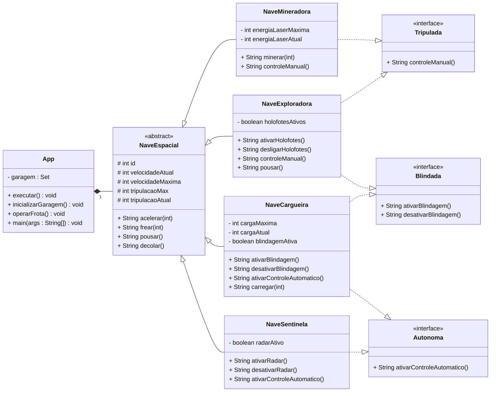

[](https://classroom.github.com/a/eVrFUgIm)

# Programação Orientada a Objetos

Dupla: Leticia Helena do Rosário Furlan e Roberto da Silva Espindola.

## Lista 4: Frota Espacial Polimórfica

### Instruções de Uso:

Para iniciar o programa digite no terminal: ```./gradlew run```.
